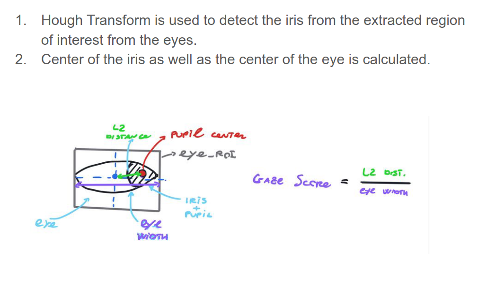

# Introduction

This system analyzes real-time data from various sensors (e.g., cameras, eye-tracking systems, and vehicle sensors) to detect signs of drowsiness, distraction, or other indicators of driver fatigue or inattention.

# Objectives
+ To detect any anomalous eye movement or position of the driver for an extended period of time.
+ To detect whether the driver is under the influence of substances or alcohol by the general movement of their eyes and head.
+ Alerting the driver in case of them being deemed distracted from the road.
# Methodology
## Landmarks Detection

## Eye Aspect Ratio(EAR) Calculation

## Gaze Estimation

## Head Pose Evaluation

## Yawn Detection

# Outputs

